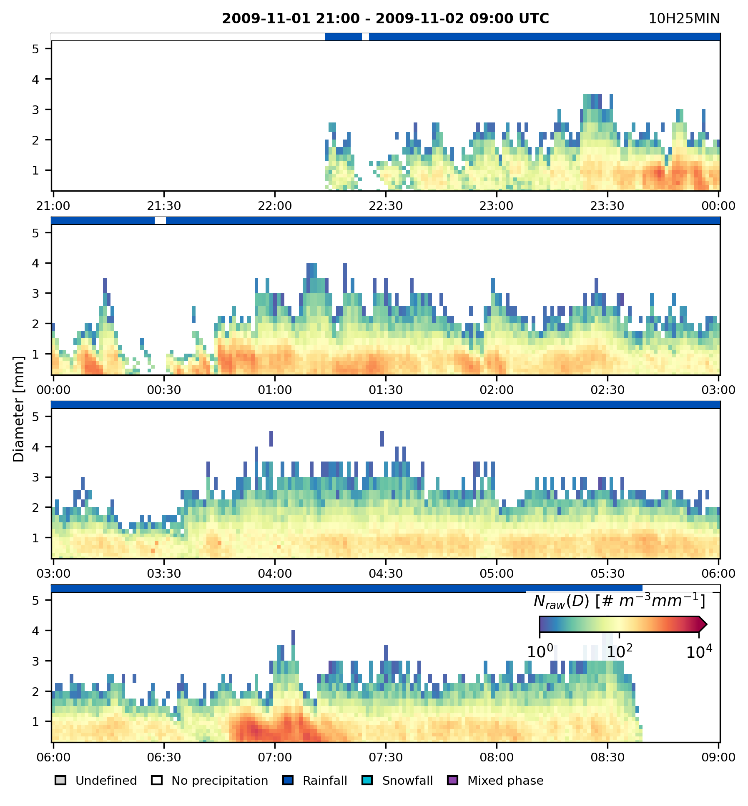

# 📦 disdrodb

An open-source python software for standardized processing, sharing, and analysis of disdrometer data

|                   |                                                                                                                                                                                                                                                                                                                                                                                                                                                                                                                                                                                                                                    |
| ----------------- | ---------------------------------------------------------------------------------------------------------------------------------------------------------------------------------------------------------------------------------------------------------------------------------------------------------------------------------------------------------------------------------------------------------------------------------------------------------------------------------------------------------------------------------------------------------------------------------------------------------------------------------- |
| Deployment        | [](https://pypi.org/project/disdrodb/) [](https://anaconda.org/conda-forge/disdrodb)                                                                                                                                                                                                                                                                                                                                                                        |
| Activity          | [](https://pypi.org/project/disdrodb/) [](https://anaconda.org/conda-forge/disdrodb)                                                                                                                                                                                                                                                                                                                                |
| Python Versions   | [](https://www.python.org/downloads/)                                                                                                                                                                                                                                                                                                                                                                                                                                                                                    |
| Supported Systems | [](https://github.com/ltelab/disdrodb/actions/workflows/tests.yml) [](https://github.com/ltelab/disdrodb/actions/workflows/tests.yml) [](https://github.com/ltelab/disdrodb/actions/workflows/tests_windows.yml) |
| Project Status    | [](https://www.repostatus.org/#active)                                                                                                                                                                                                                                                                                                                                                                                                                                                                                                            |
| Build Status      | [](https://github.com/ltelab/disdrodb/actions/workflows/tests.yml) [](https://github.com/ltelab/disdrodb/actions/workflows/lint.yml) [](https://disdrodb.readthedocs.io/en/latest/)                                                                                                                                                                     |
| Linting           | [](https://github.com/psf/black) [](https://github.com/astral-sh/ruff) [](https://github.com/codespell-project/codespell)                                                                                                                                                                                                      |
| Code Coverage     | [](https://coveralls.io/github/ltelab/disdrodb?branch=main) [](https://codecov.io/gh/ltelab/disdrodb)                                                                                                                                                                                                                                                                                                                                      |
| Code Quality      | [](https://www.codefactor.io/repository/github/ltelab/disdrodb) [](https://app.codacy.com/gh/ltelab/disdrodb/dashboard?utm_source=gh&utm_medium=referral&utm_content=&utm_campaign=Badge_grade) [](https://codescene.io/projects/36773)                                                                                                          |
| License           | [](https://github.com/ltelab/disdrodb/blob/main/LICENSE)                                                                                                                                                                                                                                                                                                                                                                                                                                                                                               |
| Community         | [](https://join.slack.com/t/disdrodbworkspace/shared_invite/zt-25l4mvgo7-cfBdXalzlWGd4Pt7H~FqoA) [](https://github.com/ltelab/disdrodb/discussions)                                                                                                                                                                                                                                                                                        |
| Citation          | [](https://zenodo.org/doi/10.5281/zenodo.7680581)                                                                                                                                                                                                                                                                                                                                                                                                                                                                                                                         |

[**Slack**](https://join.slack.com/t/disdrodbworkspace/shared_invite/zt-25l4mvgo7-cfBdXalzlWGd4Pt7H~FqoA) | [**Documentation**](https://disdrodb.readthedocs.io/en/latest/)

## 📋 Table of Contents

- [About DISDRODB](#about-disdrodb)
- [Key Features](#key-features)
- [Installation](#installation)
- [Quick Start](#quick-start)
- [Documentation](#explore-the-disdrodb-documentation)
- [Contributing](#feedback-and-contributing-guidelines)
- [Contributors](#contributors)
- [Citation](#citation)
- [License](#license)

## 🌍 About DISDRODB

DISDRODB is an international collaborative initiative to index, collect, and homogenize drop size distribution (DSD) data from disdrometers worldwide. Our mission is to establish a global standard for sharing disdrometer observations, making precipitation microphysics data accessible and interoperable.

Built on **FAIR data principles** (Findable, Accessible, Interoperable, Reusable) and adhering to **Climate & Forecast (CF) conventions**, DISDRODB provides:

- 🌐 A **decentralized data archive** for raw disdrometer data
- 📊 **Standardized NetCDF products** for seamless analysis
- 🔬 **Quality-controlled datasets** ready for scientific research
- 🤝 An **open community** for collaboration and knowledge sharing

## ✨ Key Features

### 🗄️ Data Management

- **Download** raw disdrometer data from the DISDRODB Decentralized Data Archive
- **Upload** your own disdrometer station data to contribute to the global archive
- **Explore** metadata from stations worldwide through standardized formats

### 🔄 Data Processing

- **L0 Product**: Convert raw data into standardized NetCDF format
- **L1 Product**: Generate quality-checked, homogenized measurements at multiple time resolutions
- **L2 Product**: Compute DSD parameters and derive radar variables (reflectivity, differential reflectivity, etc.)

### 📈 Analysis Tools

- **Lazy loading**: Efficiently work with large datasets using Dask/Xarray
- **Event detection**: Automatically identify and analyze precipitation events
- **Visualization**: Built-in plotting functions for DSD quick-looks and data exploration
- **xarray accessor**: Extended functionality for disdrometer-specific operations

### 🤝 Community-Driven

- Open-source and community-maintained
- Active [Slack workspace](https://join.slack.com/t/disdrodbworkspace/shared_invite/zt-25l4mvgo7-cfBdXalzlWGd4Pt7H~FqoA) for support and collaboration
- Regular updates and new features based on user feedback

______________________________________________________________________

## 🛠️ Installation

### conda (Recommended)

DISDRODB can be installed via [conda][conda_link] on Linux, macOS, and Windows:

```bash
conda install -c conda-forge disdrodb
```

If conda-forge is not set up for your system, see the [conda-forge installation guide][conda_forge_link].

### pip

Alternatively, install via [pip][pip_link]:

```bash
pip install disdrodb
```

### Development Installation

To install the latest development version, see the [documentation][dev_install_link].

______________________________________________________________________

## 🚀 Quick Start

Get started with DISDRODB in three simple steps: download metadata, configure paths, and start analyzing data.

### Step 1: Download the DISDRODB Metadata Archive

The Metadata Archive contains information about all disdrometer stations in DISDRODB (location, sensor type, data availability, etc.).

**Option A: Clone with Git (recommended for staying up-to-date):**

```bash
git clone https://github.com/ltelab/DISDRODB-METADATA.git
```

**Option B: Download a static snapshot:**

```bash
disdrodb_download_metadata_archive <path/to/DISDRODB-METADATA>
```

### Step 2: Define the DISDRODB Configuration File

Configure DISDRODB by specifying two directories:

- **`metadata_archive_dir`**: Path to your local DISDRODB Metadata Archive (the cloned repository)
- **`data_archive_dir`**: Path where DISDRODB will store downloaded raw data and processing products

> **Note:** Paths must end with `\DISDRODB` (Windows) or `/DISDRODB` (macOS/Linux).

```python
import disdrodb

# Define your local paths
metadata_archive_dir = "<path_to>/DISDRODB-METADATA/DISDRODB"
data_archive_dir = "<path_to>/DISDRODB"

# Create configuration file
disdrodb.define_configs(
    metadata_archive_dir=metadata_archive_dir, data_archive_dir=data_archive_dir
)
```

This creates a `.config_disdrodb.yml` file in your home directory.

**Verify your configuration:**

```python
import disdrodb

print("Metadata Archive:", disdrodb.get_metadata_archive_dir())
print("Data Archive:", disdrodb.get_data_archive_dir())
```

**Or via command line:**

```bash
disdrodb_metadata_archive_directory
disdrodb_data_archive_directory
```

### Step 3: Download Raw Data and Start Analyzing

**Download all available data:**

```bash
disdrodb_download_archive
```

**Download from a specific data source:**

```bash
disdrodb_download_archive --data_sources EPFL
```

**Download a specific station:**

```bash
disdrodb_download_station EPFL EPFL_2009 10
```

> 💡 **Tip:** Use `disdrodb_download_archive --help` for all available options.

______________________________________________________________________

## 💫 Working with DISDRODB Data

### Transform Raw Data into Analysis-Ready NetCDFs

Process raw data into standardized NetCDF products (L0, L1, L2) for a specific station:

```bash
disdrodb_run_station EPFL EPFL_2009 10 --parallel True --force True
```

> 💡 **Tip:** Use `disdrodb_run_station --help` to explore processing options.

### Analyze L0C Product (Raw Data in NetCDF)

The L0C product contains raw disdrometer data in standardized NetCDF format. Use `open_dataset()` to efficiently load data with lazy evaluation (data is only loaded into memory when needed):

```python
import disdrodb

ds = disdrodb.open_dataset(
    product="L0C",
    data_source="EPFL",
    campaign_name="HYMEX_LTE_SOP3",
    station_name="10",
)
ds
```

### Analyze L1 Product (Quality-Controlled Data)

The L1 product provides quality-controlled measurements at multiple temporal resolutions (1MIN, 5MIN, 10MIN, etc.), including hydrometeor classification and quality flags. This is the recommended product for precipitation analysis.

```python
import disdrodb
import matplotlib.pyplot as plt

# Load L1 product at 1-minute resolution
ds = disdrodb.open_dataset(
    product="L1",
    data_source="EPFL",
    campaign_name="EPFL_2009",
    station_name="10",
    temporal_resolution="1MIN",
)

# Compute particle counts for event detection
ds["n_particles"] = ds["n_particles"].compute()

# Identify and visualize precipitation events
for ds_event in ds.disdrodb.split_into_events(
    variable="n_particles",
    threshold=10,
    neighbor_min_size=2,
    neighbor_time_interval="5MIN",
    event_max_time_gap="2H",
    event_min_duration="20MIN",
    event_min_size=5,
    sortby=lambda ds_event: ds_event["n_particles"].sum(dim="time").max(),
    sortby_order="decreasing",
):
    # Generate DSD quick-look plots
    ds_event.disdrodb.plot_dsd_quicklook(
        hours_per_slice=3,
        max_rows=6,
    )
    plt.show()
```

You should see quick-look plots of the PSD for the identified precipitation events, similar to this:


> 📖 **Learn more:** See the [products documentation](https://disdrodb.readthedocs.io/en/latest/products.html) for detailed information.

### Explore the Metadata Archive

**Open the metadata archive directory:**

```bash
disdrodb_open_metadata_archive
```

**Load all station metadata into a pandas DataFrame:**

```python
import disdrodb

df = disdrodb.read_metadata_archive()
df.head()
```

______________________________________________________________________

## 📖 Explore the DISDRODB Documentation

This README provides a quick overview. For comprehensive information, visit our documentation:

📚 **[https://disdrodb.readthedocs.io/en/latest/](https://disdrodb.readthedocs.io/en/latest/)**

### What you'll find:

- 📊 Detailed product specifications (L0, L1, L2)
- 🔧 Advanced processing options and customization
- 📤 Guide to contributing your own data
- 💻 API reference and code examples
- 📓 Jupyter notebook tutorials
- ❓ FAQs and troubleshooting

______________________________________________________________________

## 💭 Feedback and Contributing Guidelines

We welcome contributions and feedback from the community! Here's how to get involved:

### 💬 Join the Community

- **[Slack Workspace](https://join.slack.com/t/disdrodbworkspace/shared_invite/zt-25l4mvgo7-cfBdXalzlWGd4Pt7H~FqoA)**: Join discussions, ask questions, and collaborate
- **[GitHub Discussions](https://github.com/ltelab/disdrodb/discussions)**: Share ideas and start conversations
- **[GitHub Issues](https://github.com/ltelab/disdrodb/issues)**: Report bugs or request features

### 🤝 Ways to Contribute

- 📊 **Share your data**: Contribute disdrometer observations to the archive
- 💻 **Improve code**: Submit bug fixes or new features via pull requests
- 📖 **Enhance documentation**: Help improve guides and examples
- 🧪 **Develop algorithms**: Propose new analysis methods or quality control procedures
- 🌍 **Spread the word**: Tell others about DISDRODB

See [CONTRIBUTING.rst](CONTRIBUTING.rst) for detailed guidelines.

## ✍️ Contributors

- [Gionata Ghiggi](https://people.epfl.ch/gionata.ghiggi)
- [Kim Candolfi](https://github.com/KimCandolfi)
- [Régis Longchamp](https://people.epfl.ch/regis.longchamp)
- [Charlotte Gisèle Weil](https://people.epfl.ch/charlotte.weil)
- [Jacopo Grazioli](https://people.epfl.ch/jacopo.grazioli)
- [Alexis Berne](https://people.epfl.ch/alexis.berne?lang=en)

## 📄 Citation

If you use DISDRODB in your research, please cite:

> Gionata Ghiggi, Kim Candolfi, Régis Longchamp, Charlotte Weil, Alexis Berne (2023). ltelab/disdrodb. Zenodo. https://doi.org/10.5281/zenodo.7680581

For version-specific citations, visit the [Zenodo record](https://doi.org/10.5281/zenodo.7680581).

## 📜 License

This project is licensed under the [GPL 3.0 License](LICENSE).

______________________________________________________________________

<div align="center">

**[⬆ Back to Top](#-disdrodb)**

</div>

[conda_forge_link]: https://github.com/conda-forge/disdrodb-feedstock#installing-disdrodb
[conda_link]: https://docs.conda.io/en/latest/miniconda.html
[dev_install_link]: https://disdrodb.readthedocs.io/en/latest/installation.html#installation-for-contributors
[pip_link]: https://pypi.org/project/disdrodb
